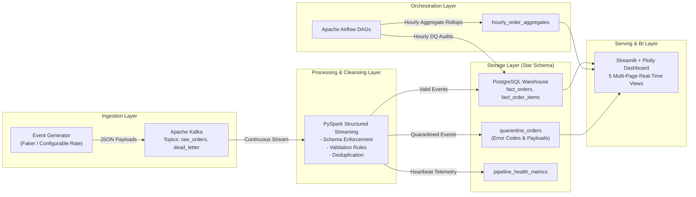

# DataPulse Live — System Architecture & Design

## 1. Executive Summary

**DataPulse Live** is an enterprise-grade real-time streaming data platform architected to ingest, process, validate, store, and visualize e-commerce transaction streams at scale.

---

## 2. Ingestion & Messaging Backbone (Apache Kafka)

- **Continuous Generation**: Synthetic orders are generated with non-repeating business IDs (`ORD-YYYYMMDD-XXXX`), dynamic basket item collections, realistic tax and pricing models, customer segmentation, and geographical distribution.
- **Controlled Error Injection**: The generator injects deliberate anomalies (null primary keys, negative prices, future timestamps, invalid status codes) at a configured probability (e.g. 4%) to exercise data quality and quarantine workflows.
- **Kafka Topics**:
  - `raw_orders`: Ingests high-velocity JSON order payloads partitioned by `order_id`.
  - `dead_letter_orders`: Quarantined events that fail structural or schema validation.

---

## 3. Stream Processing Engine (PySpark Structured Streaming)

- **Explicit Schema Enforcement**: Incoming JSON records are parsed against a strict `StructType` schema. Malformed records are captured without crashing stream executors.
- **Data Cleansing & Validation Rules**:
  - Null checks on mandatory identifiers (`event_id`, `order_id`, `customer_id`, `location_id`, `payment_method_id`).
  - Domain validation on payment methods and order statuses against reference sets.
  - Value sanity checks (`total_amount >= 0`, `quantity > 0`, `unit_price >= 0`).
  - Temporal sanity checks (rejecting timestamps beyond allowed drift thresholds).
- **Quarantine Routing**: Invalid records are enriched with specific failure codes (`NULL_CUSTOMER_ID`, `NEGATIVE_PRICE`, etc.) and persisted directly into `quarantine_orders`.
- **Idempotency Guarantees**: Batches are written to PostgreSQL using transactional upserts (`ON CONFLICT (order_id) DO UPDATE`), preventing duplicate records even during stream re-runs or consumer retries.

---

## 4. Orchestration & Data Quality (Apache Airflow)

- **Data Quality Reconciliation DAG (`datapulse_dq_reconciliation_dag`)**:
  - Executes hourly checks for null values, foreign key referential integrity orphans, and financial arithmetic reconciliation (`net_amount == gross - discount + tax`).
  - Logs results to `data_quality_audit_log` with pass rates and record counts.
- **Hourly Aggregate Rollup DAG (`datapulse_hourly_aggregate_rollup_dag`)**:
  - Pre-aggregates transactional orders into analytical summary marts (`hourly_order_aggregates`) for sub-second dashboard query performance.
- **Pipeline Health Heartbeat DAG (`datapulse_pipeline_health_dag`)**:
  - Periodically checks warehouse latency and table freshness.

---

## 5. Analytics & Visualization (Streamlit & Plotly)

- **Multi-Page Architecture**:
  1. `Executive Overview`: GMV trajectory, AOV, revenue breakdown by product category and payment method.
  2. `Live Order Monitor`: Continuous real-time streaming feed, global geographic distribution map, and line item drill-down inspector.
  3. `Pipeline Monitoring`: Real-time operational health of Kafka, Spark, Airflow, and PostgreSQL warehouse with latency distribution metrics.
  4. `Data Quality Dashboard`: Validation pass rate gauge, quarantine failure code bar charts, raw payload inspection, and Airflow audit history.
  5. `Historical Analytics`: Customer tier cohort spending, hourly volume distribution, and analytical mart exploration.
