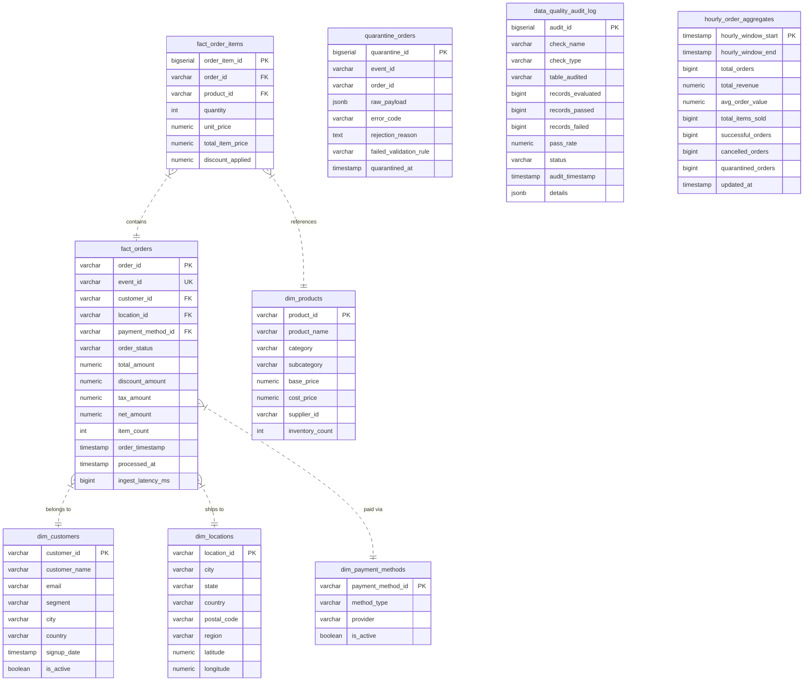

# DataPulse Live — Database Schema & Data Warehouse Modeling

## 1. Dimensional Star Schema Design

---

## 2. Table Data Dictionary

### Dimension Tables

| Table Name | Primary Key | Description |
| :--- | :--- | :--- |
| `dim_customers` | `customer_id` | Master customer profile with tiers (VIP, Enterprise, Regular, Standard) and registration timestamps. |
| `dim_products` | `product_id` | Catalog SKUs with categories (Electronics, Apparel, Home & Kitchen), base pricing, and supplier info. |
| `dim_locations` | `location_id` | Geographical fulfillment zones with latitude/longitude coordinates and region classifications. |
| `dim_payment_methods` | `payment_method_id` | Supported payment options (Credit Card, PayPal, Apple Pay, BNPL, Crypto). |
| `dim_dates` | `date_key` | Conformed calendar dimension with ISO weeks, months, quarters, and weekend flags. |

### Fact & Audit Tables

| Table Name | Grain | Description |
| :--- | :--- | :--- |
| `fact_orders` | One row per order transaction | Core transactional fact with foreign keys to dimensions, gross/net financial calculations, and latency. |
| `fact_order_items` | One row per basket line item | Detailed line items linking individual SKUs, quantities, and line item discounts. |
| `quarantine_orders` | One row per rejected event | Dead-letter storage holding raw JSON payloads, violation error codes, and audit reasons. |
| `data_quality_audit_log` | One row per Airflow DQ check execution | Historical record of null checks, referential integrity tests, and pass rates. |
| `pipeline_health_metrics` | One row per telemetry sample | Time-series operational metric storage for Spark batch latency, consumer lag, and row counts. |
| `hourly_order_aggregates` | One row per 1-hour temporal window | Analytical rollup mart for rapid reporting queries. |
